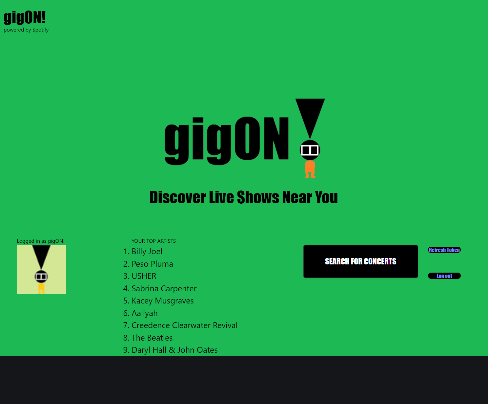

# gigON

An API-powered concert search tool powered by Spotify.

## gigON Description
People like music. People also like live music. Our app is designed to take a users data from Spotify and tell them relevant concerts coming up in their area. This app utilizies APIs from Spotify and Ticketmaster to pull a user's Spotify Top Artists. It utilizes the user's local storage to save their top artists and in a second page filters those artists when searching for concerts. When the user inputs their location, those results are filtered further according to the entered city and the user is shown their results. 

## User Story
AS A melomaniac  
I WANT to be able to link my spotify music to ticketmaster  
SO I can see relevant concerts coming up near me for the music I like  

## Acceptance Criteria
GIVEN a music app with login interface  
WHEN I log in using my Spotify account  
THEN I am asked permission to access my data  
WHEN my account is successfully authenticated  
THEN my data is fetched from Spotify and I am presented with a list of my top artists 
WHEN I click on a button to search for concerts  
THEN I am taken to another page to enter my location  
WHEN I input my location into a modal  
THEN the app fetches upcoming concerts within the radius around my location, specific to my top artists  
WHEN I select a concert  
THEN I am transported to Ticketmaster where I can view and purchase tickets  

## Wire Frame Images

## Usage

Access the deployed app by using the following link: [https://cneale92.github.io/gigON/]

As per Spotify's rules, an app under Development Mode can only be used by authorized Spotify accounts. In order to test the app, please use the following Spotify credentials:  
Email: trygigon@gmail.com  
Password: l0v3th!s4pp!  

##  Credits

This app was developed throught the collaborative efforts of: Connor Neale (Cneale92), Tyler Payne (edamama), Destinee Jimenez (dessyjim), and Nicole Arias (nearias3).

Useful information about coding, including tutorials and guides, were provided by the UT Bootcamp GitLab: [https://git.bootcampcontent.com/University-of-Texas-at-Austin/UTA-VIRT-FSF-PT-05-2024-U-LOLC/].

The documentation for the Spotify API: [https://developer.spotify.com/documentation/web-api]

The documentation for Ticketmaster's Discovery API: [https://developer.ticketmaster.com/products-and-docs/apis/discovery-api/v2/]

The Bulma CSS framework and its documentation: [https://bulma.io/documentation/]

We found helpful tips across different Google searches, including but not limited to: 
[https://developer.mozilla.org/en] [devdocs.io] [https://stackoverflow.com/]

## License
Please refer to the license in the repo.
